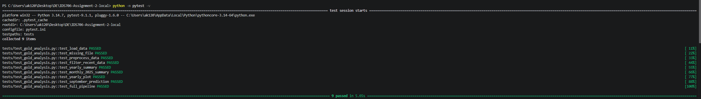
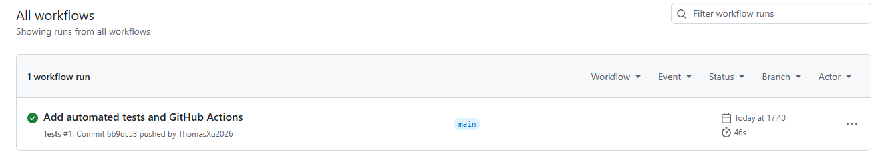

# Gold Price Data Analysis: Pandas and Polars

## Project Overview

This project analyzes historical gold-related market data from 2015 to 2025.  
The same analysis is completed twice: first with **Pandas** and then with **Polars**.

The project includes:

- Importing and inspecting the dataset
- Checking missing values and duplicates
- Filtering recent data
- Grouping gold data by year
- Visualizing yearly average GLD values
- Calculating monthly average GLD values for 2025
- Using Linear Regression to predict the average GLD value for September 2025
- Comparing the Pandas and Polars results

## Dataset

Source: Kaggle  
Dataset: Gold Price 2015-2025  
https://www.kaggle.com/datasets/mdanwarhossain200110/gold-price-2015-2025

The dataset contains **2,666 rows and 6 columns**:

- `Date`
- `SPX`
- `GLD`
- `USO`
- `SLV`
- `EUR/USD`

The data runs from January 2015 through August 14, 2025, so the 2025 data is not a complete year.

## Libraries Used

- pandas
- polars
- matplotlib
- scikit-learn

## Setup

1. Download the dataset file `gold_data_2015_25.csv` from Kaggle

2. Place `gold_data_2015_25.csv` in the same folder as `w2_mini_da.ipynb`.

3. Install the required Python libraries:
   pip install pandas polars matplotlib scikit-learn
4. Open the notebook file with the coding tool of your choice, and run all cells from top to bottom.

## Pandas Analysis

### 1. Import and Inspect the Data

The dataset was loaded using `pd.read_csv()`.

I used to inspect the data:

- `df.shape`
- `df.head()`
- `df.info()`
- `df.describe()`
- `df.isnull().sum()`
- `df.duplicated().sum()`

The dataset contains:

- **2,666 rows**
- **6 original columns**
- **0 missing values**
- **0 duplicate rows**

### 2. Filtering and Grouping

The `Date` column was converted to datetime format.

I filtered the dataset to include data from **2020 onward**, which produced **1,411 rows**.

A new `Year` column was created from the `Date` column.  
The data was then grouped by year to calculate:

- Mean GLD value
- Minimum GLD value
- Maximum GLD value
- Number of observations

Some yearly average GLD values were:

- 2015: about **111.15**
- 2020: about **166.65**
- 2023: about **180.45**
- 2024: about **221.10**
- 2025: about **288.87**

The 2025 average is based only on the available data through August 14, 2025.

### 3. Visualization

A line plot was created to show the **average GLD value by year from 2015 to 2025**.

The plot shows that the yearly average GLD value generally increased over time, with stronger growth in the later years. Since the 2025 date ended with August, therefore the 2025 data show in the plot has only represent the avergae yearly gold price using date from January to August.

### 4. Machine Learning

For the machine learning experiment, I filtered the data to **2025** and calculated the average GLD value for each month from January through August.

The model used:

- **Input (X):** Month
- **Output (y):** Average monthly GLD value
- **Algorithm:** Linear Regression from scikit-learn

The model was trained on months 1 through 8 and then used to predict month 9.

The Pandas-based analysis predicted:

**September 2025 average GLD = 328.83**

---

## Polars Analysis

The same data analysis steps were repeated using **Polars**.

### 1. Import and Inspect the Data

The dataset was loaded with `pl.read_csv()`.

The data is inspected using:

- `df_pl.shape`
- `df_pl.head()`
- `df_pl.schema`
- `df_pl.describe()`
- `df_pl.null_count()`
- `df_pl.is_duplicated().sum()`

Polars also found:

- **2,666 rows**
- **6 original columns**
- **0 null values**
- **0 duplicate rows**

### 2. Filtering and Grouping

The `Date` column was converted from string format to the Polars `Date` type.

The data was filtered to records from **2020 onward**, producing the same **1,411 rows** as the Pandas analysis.

A `Year` column was created and the data was grouped by year using `group_by()`.

The same yearly GLD statistics were calculated:

- Mean
- Minimum
- Maximum
- Count

### 3. Visualization

The Polars yearly summary was used with Matplotlib to create the same yearly average GLD line plot.

### 4. Machine Learning

The 2025 data was filtered using Polars and grouped by month.

The monthly average GLD values for January through August were converted to NumPy arrays with `.to_numpy()` so they could be used by scikit-learn.

The same Linear Regression model was then used.

The Polars-based analysis predicted:

**September 2025 average GLD = 328.83**

---

## Pandas vs. Polars

Both Pandas and Polars produced the same main analysis results.
Pandas uses methods such as `groupby()`, while Polars uses expressions and methods such as `group_by()`, `filter()`, and `with_columns()`.

## Main Findings

- The dataset is clean, with no missing values or duplicate rows.
- Average GLD values generally increased from 2015 to 2025.
- The increase became much stronger in the later years of the dataset.
- Pandas and Polars produced matching results for the filtering, grouping, and machine learning analysis.
- The Linear Regression model predicted an average GLD value of approximately **328.83** for September 2025.


## Files

- `w2_mini_da.ipynb` - Jupyter Notebook containing the Pandas and Polars analysis
- `README.md` - Project documentation

---

## Testing, Reproducibility, and Continuous Integration

This phase of the project focuses on making the data analysis workflow more reproducible and reliable.

The Pandas analysis was refactored into reusable functions in `gold_analysis.py`, allowing the major parts of the workflow to be tested independently with `pytest`. In addition to unit tests for the core functionality, the project includes a system/integration test that validates the complete analysis pipeline.

### Automated Testing

The project currently contains **9 automated tests** in:

```text
tests/test_gold_analysis.py
```

The tests cover the major components of the workflow.

#### Unit and Core Functionality Tests

The following tests validate individual parts of the analysis:

1. **Data loading — `test_load_data`**
   - Verifies that the CSV file loads successfully.
   - Checks that the dataset has the expected shape of 2,666 rows and 6 columns.
   - Checks that the expected columns are present.

2. **Missing-file edge case — `test_missing_file`**
   - Attempts to load a file that does not exist.
   - Verifies that the program correctly raises a `FileNotFoundError`.

3. **Data preprocessing — `test_preprocess_data`**
   - Verifies that the `Date` column is converted to datetime format.
   - Checks that the `Year` feature is created correctly.
   - Confirms that the original DataFrame is not modified.

4. **Data filtering — `test_filter_recent_data`**
   - Verifies that filtering from January 1, 2020 onward works correctly.
   - Confirms that the filtered dataset contains 1,411 rows.
   - Checks that all retained observations are from 2020 or later.

5. **Yearly grouping and summary statistics — `test_yearly_summary`**
   - Verifies the yearly GLD grouping.
   - Checks the mean, minimum, maximum, and count statistics.
   - Confirms expected values for the 2020 data.

6. **Feature engineering and monthly aggregation — `test_monthly_2025_summary`**
   - Verifies that the 2025 data is grouped correctly by month.
   - Confirms that January through August are included.
   - Checks an expected monthly average GLD value.

7. **Data visualization — `test_yearly_plot`**
   - Verifies that the yearly average GLD line plot is created successfully.
   - Checks the chart title, axis labels, and plotted line.

8. **Machine learning prediction — `test_september_prediction`**
   - Trains the Linear Regression model using the January through August 2025 monthly averages.
   - Verifies that the predicted September 2025 average GLD value is approximately **328.83**.

These tests check both expected behavior and an important edge case, as required by the assignment.

### System / Integration Test

The project also includes a full system test:

```text
test_full_pipeline
```

This test runs the complete workflow from beginning to end:

```text
CSV Data
   ↓
Data Loading
   ↓
Date Preprocessing
   ↓
Year Feature Creation
   ↓
Filtering
   ↓
Yearly Grouping
   ↓
Monthly Aggregation
   ↓
Visualization
   ↓
Linear Regression
   ↓
September Prediction
```

The system test verifies:

- the processed dataset shape
- the number of observations from 2020 onward
- the number of yearly groups
- the number of available 2025 monthly groups
- the final September 2025 prediction

This ensures that the individual components of the project also work correctly when they are combined into the complete analysis workflow.

### Running the Tests

The complete test suite can be run locally from the project root directory using:

```bash
python -m pytest -v
```

The current test suite passes successfully:

```text
9 passed
```

### GitHub Actions Continuous Integration

GitHub Actions is used to automatically run the complete test suite in a clean environment.

The workflow is located at:

```text
.github/workflows/tests.yml
```

The workflow automatically runs when:

- code is pushed to the `main` branch
- a pull request is opened or updated against the `main` branch

The GitHub Actions workflow performs the following steps:

1. Checks out the repository.
2. Sets up Python 3.12.
3. Installs the project dependencies from `requirements.txt`.
4. Runs the complete test suite with:

```bash
python -m pytest -v
```

The workflow has successfully completed with all **9 tests passing**.

### CI Status

[](https://github.com/ThomasXu2026/IDS706-Assignment-2/actions/workflows/tests.yml)

Successful GitHub Actions workflow run:

https://github.com/ThomasXu2026/IDS706-Assignment-2/actions/runs/35788051797

### Test Results Summary

The complete test suite was executed successfully both locally and through GitHub Actions.

Local test result:

9 passed

#### Local pytest Results

The following screenshot shows the local pytest run with all tests passing:



#### GitHub Actions Results

The following screenshot shows the successful GitHub Actions workflow:



### Testing and CI Repository Structure

The testing and continuous integration files are organized as follows:

```text
IDS706-Assignment-2/
├── .github/
│   └── workflows/
│       └── tests.yml
├── github_action.png
├── test_passed.png
├── tests/
│   └── test_gold_analysis.py
├── gold_analysis.py
├── gold_data_2015_25.csv
├── pytest.ini
├── requirements.txt
├── README.md
├── rust_vs_python_intro.ipynb
└── w2_mini_da.ipynb
```

The main files added for this phase are:

- `gold_analysis.py` — reusable Pandas functions and complete analysis pipeline
- `tests/test_gold_analysis.py` — unit tests and system/integration test
- `pytest.ini` — pytest configuration
- `requirements.txt` — dependencies required for local testing and CI
- `.github/workflows/tests.yml` — GitHub Actions continuous integration workflow

### Submission

GitHub Repository:

https://github.com/ThomasXu2026/IDS706-Assignment-2

The repository includes the automated tests, GitHub Actions workflow, CI status badge, and screenshots demonstrating that the tests pass successfully.

---

## Project Refinement

For this phase of the project, I improved the reliability, code quality, and analytical usefulness of the original gold-price analysis.

The main improvements include:

- Generalizing functions that were previously specific to 2025
- Adding reusable data-quality checks
- Adding outlier detection for unusual daily GLD returns
- Adding a historical backtest to evaluate the prediction approach
- Expanding the automated test suite from 9 to 15 tests
- Adding Black formatting and flake8 linting
- Adding code-quality checks to GitHub Actions

### Real-World Problem

The project examines historical GLD price behavior and uses recent monthly trends to make a simple short-term prediction.

The original analysis produced a September 2025 prediction, but a future prediction alone does not show whether the modeling approach is reliable. To improve the analysis, I added a historical backtest using 2024 data so the model could be evaluated against a known result.

---

## Data Quality and Outlier Treatment

The dataset was checked for missing values and duplicate observations.

Results:

```text
Missing values: 0
Duplicate rows: 0
```

A reusable `data_quality_summary()` function was added so these checks can be performed automatically and tested.

### Outlier Detection

Instead of detecting outliers directly from GLD price levels, I examined **daily percentage returns**.

This choice was made because GLD prices show a long-term upward trend. Applying an outlier rule directly to the price level could incorrectly classify later high prices as unusual simply because the market increased over time.

The IQR method identified:

```text
96 potential unusual daily GLD movements
```

These observations were **not automatically removed**.

Large daily price movements may represent real market events rather than data-entry errors, so they were retained for the analysis.

---

## Refactoring and Code Quality

Several functions were generalized to make the analysis easier to reuse.

### Before

The original project contained functions tied to one specific year or prediction:

```python
monthly_2025_summary(df)
predict_september(monthly_2025)
```

### After

The analysis now uses reusable functions:

```python
monthly_summary(df, year)
predict_month(monthly_data, target_month)
```

For example:

```python
monthly_summary(df, 2024)
monthly_summary(df, 2025)

predict_month(monthly_2025, 9)
```

This reduces duplicated logic and allows the same workflow to be used for different years and target months.

Additional reusable functions were added:

```text
data_quality_summary()
detect_return_outliers()
backtest_month_prediction()
```

The original function names were retained as compatibility wrappers so the earlier project tests and interface continue to work.

### Code Formatting and Linting

Python code is formatted with **Black** and checked with **flake8**.

Local checks can be run with:

```bash
python -m black --check gold_analysis.py tests
python -m flake8 --config=.flake8 gold_analysis.py tests
python -m pytest -v
```

Current local results:

```text
Black: passed
flake8: 0 errors
pytest: 15 passed
```

---

## Model Backtesting

The original analysis predicted the September 2025 average GLD value using January through August 2025 data.

To evaluate whether the same modeling approach can produce a reasonable historical prediction, I added a backtest using 2024 data.

The model was trained using January through November 2024 monthly averages and used to predict December 2024.

Results:

```text
Predicted December 2024 GLD: 255.21
Actual December 2024 GLD:    243.51
Absolute error:               11.70
Percentage error:              4.80%
```

The backtest shows that the simple linear model produced a prediction within approximately **4.8%** of the actual December average.

This does not prove that the model will always predict future prices accurately, but it provides a measurable historical evaluation instead of relying only on an unverified future prediction.

---

## Updated Automated Testing

The automated test suite was expanded from **9 tests to 15 tests**.

The new tests cover:

- Data-quality summary
- Daily-return outlier detection
- Generalized monthly summaries
- Missing-year edge case
- Invalid target-month edge case
- Historical backtesting

The existing tests for data loading, preprocessing, filtering, aggregation, visualization, prediction, and the complete integration pipeline are still included.

The full suite currently passes:

```text
15 passed
```

---

## Updated Continuous Integration

The GitHub Actions workflow now performs three automated quality checks:

```text
Black formatting check
        ↓
flake8 linting
        ↓
pytest test suite
```

The workflow runs automatically on pushes to `main` and pull requests targeting `main`.

The CI badge continues to show the latest workflow status:

[](https://github.com/ThomasXu2026/IDS706-Assignment-2/actions/workflows/tests.yml)